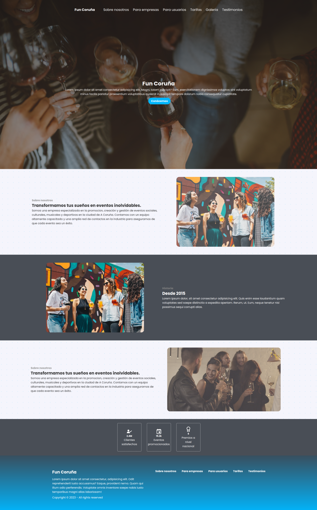

# funCoruna
# Fun Coruña

**Fun Coruña** is a fictional web project developed for the *Web Development* course in the Computer Engineering degree program. It is a platform that promotes and organizes social, cultural, musical, and sports events in the city of A Coruña.

The project simulates the core functionality of a local event-discovery website. Users can explore different types of events through an intuitive interface and get information about services for companies and individuals.

## 🔧 Technologies Used

- **HTML5** & **CSS3** – Structure and styling of the website
- **JavaScript** – Dynamic behaviors and interactions
- **jQuery** – Simplified DOM manipulation and event handling
- **AJAX** – Asynchronous data loading
- **JSON & XML** – Data formats used for event information

### Home Page

### About us page
