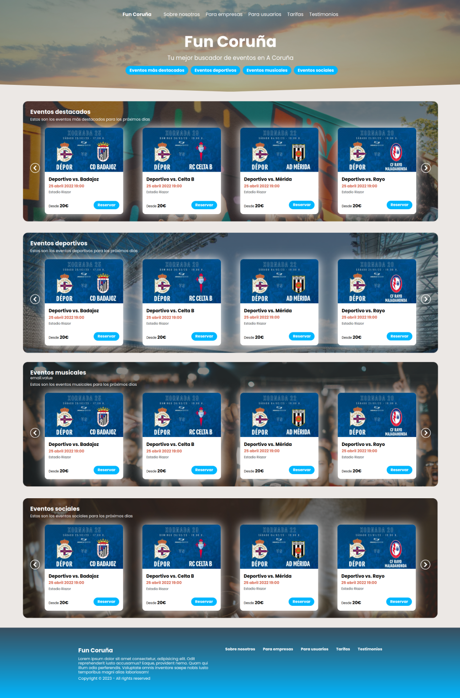

# Fun Coruña

**Fun Coruña** is a fictional web project developed for the *Web Development* course in the Computer Engineering degree program. It is a platform designed to **promote and manage events in the city of A Coruña**, offering services tailored to both individuals and businesses.

The platform allows:
- **Citizens** to explore cultural, musical, social, and sports events happening in the city.
- **Companies and organizations** to promote their own events, access promotional tools, and reach a local audience.

There are **dedicated service sections and pricing plans** for each type of user (individuals and companies), ensuring that both casual attendees and professional event organizers can find value in the platform.

## 🌐 Live Demo
[Click here to view the live demo](https://ivanlado.github.io/fun-coruna-website/)

## Home Page

## About us page

